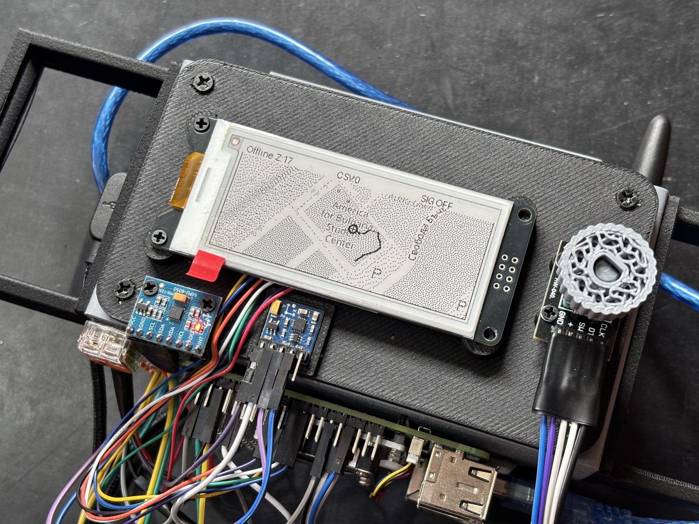

# 

Tooes is a Raspberry Pi-based passive RF navigation prototype. The firmware
listens to broadcast cellular signals, resolves observed towers against a local
OpenCellID database, and fuses the RF fixes with IMU dead-reckoning to track
position on a small e-paper map display.



## What The Repo Does Today

- The main app starts from a known GPS coordinate (`INITIAL_L`), tracks
  short-range movement with the MPU-6050 accelerometer and QMC5883L
  magnetometer, and blends in periodic SDR-based position fixes as the user
  moves. The fused path is rendered live on the e-paper display.
- A walking sweep POC performs 2D dead-reckoning from accelerometer data and
  magnetometer heading and visualises the path and RSSI bars in a desktop
  Pygame window. It does not use the MPU-6050 gyroscope.
- The radio path implements the GSM `grgsm_scanner` flow. LTE protocol-specific
  work can be added later without changing the top-level documentation
  structure.

## Documentation

- [System architecture](docs/architecture.md)
- [Hardware and wiring](docs/hardware.md)
- [Motion estimation math](docs/algorithms/motion-estimation.md)
- [RF localization pipeline](docs/algorithms/rf-localization.md)
- [Raspberry Pi setup and operations](docs/operations/pi-setup.md)
- [Experiments and proof-of-concepts](docs/experiments.md)
- [Firmware-specific reference](firmware/README.md)

## Repository Layout

- `firmware/` — Raspberry Pi firmware: HAL, navigation engine, runtime
  orchestrator, UI, scripts, and tests.
- `firmware/navigation/` — navigation engine: IMU sample processing, SDR fix
  blending, trace logging, and configuration.
- `firmware/runtime/` — background threading: orchestrator and navigation
  worker that feed the UI.
- `signal_processing/` — SDR positioning algorithms (trilateration, Kalman
  filter, RF-IMU fusion). Experimental.
- `scripts/` — repo-level utilities including the Pi setup script.
- `external/waveshare-epd/` — Waveshare e-paper driver submodule.
- `assets/` — 3D-printable hardware assets.
- `separate_component_files/` — standalone experiments and component-specific
  utilities.

## Quick Start

### 1. Run the test suite

```bash
python -m pytest firmware/tests/ -v
```

### 2. Exercise the mock or replay RF path without Pi hardware

```bash
HAL_BACKEND=replay HAL_REPLAY_PATH=firmware/tests/fixtures/golden_sweep.jsonl \
python -c "from firmware.hal import get_sweep_source; print(list(get_sweep_source())[:2])"
```

### 3. Deploy and run on the Raspberry Pi

See [docs/operations/pi-setup.md](docs/operations/pi-setup.md) for the full
guide. The short version:

```bash
# From your laptop — syncs code, configures I2C, sets up git for future pulls:
PI_PASS=<password> bash scripts/setup_pi.sh [user@host]

# Then on the Pi — install dependencies and set your starting location:
pip3 install --break-system-packages -r firmware/requirements.txt

cat > .env.local <<'EOF'
INITIAL_L=42.012280,23.095261
EOF

# Launch the app:
HAL_BACKEND=grgsm \
HAL_ROTATION=qmc5883l \
HAL_ACCEL=mpu6050 \
HAL_GRGSM_SCANNER_CMD="grgsm_scanner -b GSM900 -a 'driver=sdrplay'" \
python3 -m firmware.run
```

`INITIAL_L` is the absolute starting point used by the navigation engine. The
app then tracks IMU-based relative movement locally and periodically blends in
SDR fixes as it moves away from the last anchor.

While running, the fused path is written to
`firmware/logs/navigation_trace_*.jsonl` unless you set
`NAV_PATH_LOG_ENABLED=false`.

## Required Runtime Assets

- `external/waveshare-epd/` must be populated with
  `git submodule update --init --recursive` before the e-paper display path
  can import the Waveshare driver.
- `firmware/data/<mcc>.csv` must exist locally for any country code you want
  to resolve through OpenCellID. These files are intentionally not committed.
- `firmware/offline_tiles/` is optional but required for the map view to
  render real offline tiles instead of placeholders.

## Important Notes

- The absolute position estimate in the main app is not true trilateration.
  The current implementation is a heuristic RSSI-weighted centroid over the
  resolved towers, used as a periodic correction anchor for the IMU track.
- The motion stack is currently accelerometer plus magnetometer; gyroscope
  fusion is not yet implemented.
- The repo contains both product code and experiments. See
  [docs/experiments.md](docs/experiments.md) for the current boundary.
